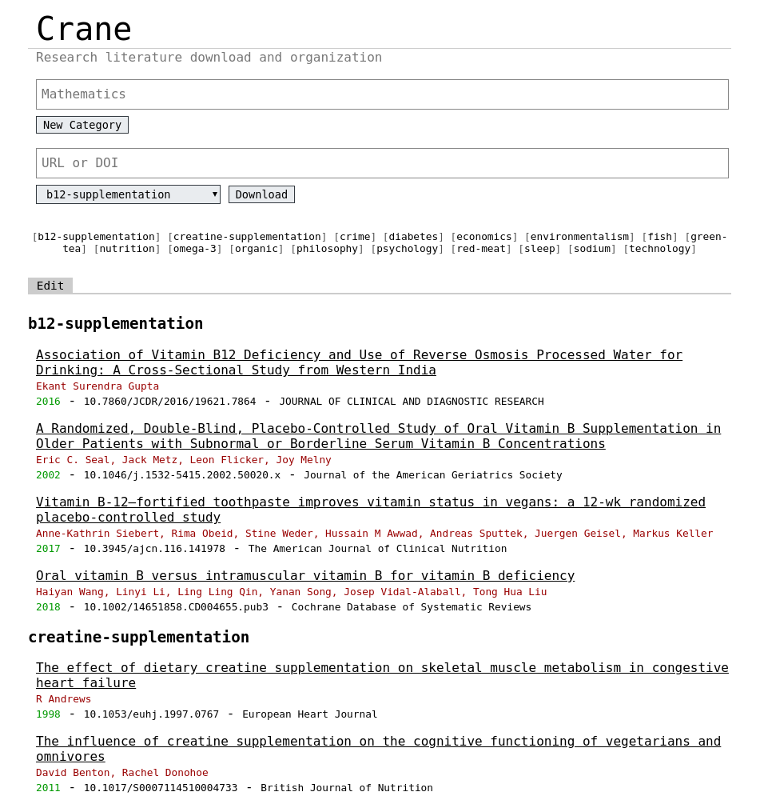

# Crane

Crane is a minimal self-hosted research literature organizational web service
with support for paper download and metadata retrieval.

No databases or app-proprietary formats are used. Papers are categorized by the
directories in which they're stored, and XML metadata is retrieved from the
[doi.org](https://www.doi.org/) API and written alongside each paper for which
its DOI is known.



## Installation

Crane can be compiled with `make` or `go build`, and installed system-wide by
running `make install` with root-level permissions.

## Usage

Crane can be run locally or on a server. The index (`"/"`) endpoint lists papers
but does not permits modification to the set. The admin (`"/admin/"`) endpoint
supports optional authentication and permits paper download, deletion, and
moving between categories, as well as category addition, deletion, and rename.

```
Usage of ./crane:
  -host string
        IP address to listen on (default "127.0.0.1")
  -port uint
        Port to listen on (default 9090)
  -path string
        Absolute or relative path to papers folder (default "./papers")
  -sci-hub string
        Sci-Hub URL (default "https://sci-hub.se/")
  -user string
        Username for /admin/ endpoints (optional)
  -pass string
        Password for /admin/ endpoints (optional)
```

By default, crane listens on `127.0.0.1:9090` but this is configurable with the
`--host` and `--port` parameters. Authentication is optional but can be enabled
with `--user` and `--pass` parameters; the index is always publicly accessible.

Papers are written to `--path`, stored in directories which serve as paper
categories.
